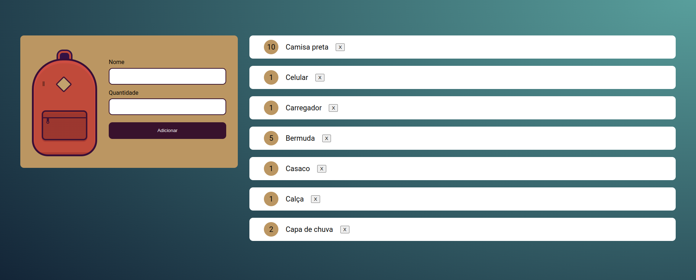

# Projeto Mochila de Viagem

Projeto mochila de viagem desenvolvido durante o curso de Javascript da Alura.

<!-- Inserir imagem com a #vitrinedev ao final do link -->

<!--
## Detalhes do projeto

Textos e imagens que descrevam seu projeto, suas conquistas, seus desafios, próximos passos, etc...
-->

